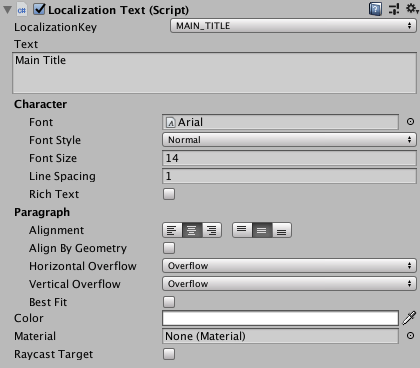
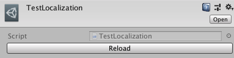

# EasyLocalization

## 安装

可通过修改package.json，在其中加入如下条目安装：
```json
{
  "com.yj.easylocalization": "http://192.168.0.254:8081/common/easylocalization.git#upm"
}
```

## 创建`Localization`子类

`EasyLocalization`不对具体的多语言数据文件格式和加载方式做限制，使用者只需创建继承自抽象类`Localization`的实体子类，实现`LoadDic`抽象方法，即可开始使用。`Localization`本身继承自`ScriptableObject`，实现`Localization`的子类需要在工程内只创建一份`ScriptableObject`资源文件。具体示例如下：

```csharp
[CreateAssetMenu(menuName = "Localization", fileName = "TestLocalization")]
public class TestLocalization : Localization
{
    protected override IReadOnlyDictionary<string, string> LoadDic()
    {
        // 实际使用中此处应为加载多语言字符串配置文件的代码，只需通过各种反序列化方式返回多语言的键值对Dictionary即可。
        return new Dictionary<string, string>
        {
            {"MAIN_TITLE", "Main Title"},
            {"CLOSE_BTN", "Close"}
        };
    }
}
```

## UGUI界面中添加`LocalizationText`

在场景中通过`UI > LocalizationText`添加带有多语言功能的`Text`控件，其带有自定义的`Inspector`，可直接通过`LocalizationKey`选择所关联的字典`Key`。 如下图所示：



## 代码中查询`Key`值

创建`Localization`的子类后，运行时可通过`Localization.instance`访问实例。`Localization`实现了`Indexer`，可通过[]语法直接查询。

```csharp
string value = Localization.instance["key值"];
```

## 切换语言时更新文本

在切换语言时，需要通过调用`Localization`的`UpdateDic`方法，对内部字典进行更新。更新结果会通过`LocalizationText`进行实时展示。

```csharp
Dictionary<string, string> dic = SomeLoadFuncByCountryCode("country code");  // 大概会有这么一个方法，伪代码
Localization.instance.UpdateDic(dic);
```

## Localization编辑器下的Reload功能

有时在编辑器启动的状态下，多语言配置文件发生了更新，这时需要进行重新加载，以便`LocalizationText Inspector`上能显示新的Key或Value值。
可通过点击`Localization`子类的资源文件`Inspector`上的`Reload`按钮实现。如下图：


